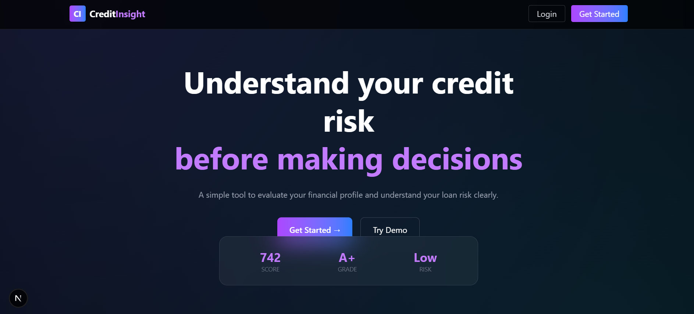
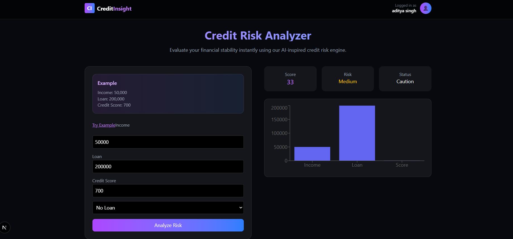

# 💳 CreditInsight — Credit Risk Analysis App

A modern full-stack web application that helps users analyze their credit risk based on financial inputs like income, loan amount, and credit score.

Built using **Next.js**, **NextAuth**, and **Cloudinary**, this project focuses on clean UI, secure authentication, and real-time risk calculation.

---
## 🚀 Live Demo

**Live Website:** [https://next-js-learning-mu-seven.vercel.app/](https://next-js-learning-mu-seven.vercel.app/)

**Deployed on:** Vercel

---

## 🚀 Features

* 🔐 **Authentication with NextAuth**

  * Secure login & signup
  * Google OAuth integration
  * Session-based authentication

* 📊 **Credit Risk Analyzer**

  * Calculates risk based on:

    * Income
    * Loan amount
    * Credit score
    * Existing loans
  * Provides:

    * Risk Score
    * Risk Level (Low / Medium / High)
    * Approval Status

* 🧑‍💼 **User Profile**

  * View profile details
  * Edit name & profile image
  * Profile image upload via Cloudinary

* 🎨 **Modern UI**

  * Responsive design
  * Glassmorphism + gradient styling
  * Smooth animations with Framer Motion

---

## 🛠️ Tech Stack

* **Frontend:** Next.js (App Router), React
* **Authentication:** NextAuth
* **Database:** MongoDB
* **Image Storage:** Cloudinary
* **Styling:** Tailwind CSS
* **Animations:** Framer Motion
* **Charts:** Recharts

---

## 📁 Project Structure

```
src/
│
├── app/
│   ├── page.tsx          # Credit risk page  
│   ├── home/             # Home page
│   ├── login/            # Login page
│   ├── register/         # Register page
│   ├── profile/          # Profile page
│   ├── edit/             # Edit profile
│   └── api/              # API routes
│
├── context/              # User context
├── model/                # MongoDB models
├── lib/                  # DB connection
├── middleware.ts         # Route protection
```

---

## ⚙️ Installation

### 1. Clone the repository

```bash
git clone https://github.com/adityarajsingh11/project2-backend.git
cd project2-backend
```

### 2. Install dependencies

```bash
npm install
```

### 3. Setup environment variables

Create a `.env` file:

```env
MONGODB_URL=your_mongodb_url
NEXT_AUTH_SECRET=your_secret

GOOGLE_CLIENT_ID=your_google_client_id
GOOGLE_CLIENT_SECRET=your_google_client_secret

CLOUDINARY_CLOUD_NAME=your_cloud_name
CLOUDINARY_API_KEY=your_api_key
CLOUDINARY_API_SECRET=your_api_secret
```

---

### 4. Run the project

```bash
npm run dev
```

App runs on:

```
http://localhost:3000
```

---

## 🔐 Authentication Flow

* Public Routes:

  * `/home`
  * `/login`
  * `/register`

* Protected Routes:

  * `/`
  * `/profile`

Middleware ensures only authenticated users can access protected pages.

---

## 📊 Risk Calculation Logic

The application calculates risk using normalized values:

* Credit Score impact
* Loan-to-Income ratio
* Income strength
* Existing loan penalty

Final output:

* Risk Score (0–100)
* Risk Level
* Approval Status

---

## 📸 Screenshots


### 🏠 Home Page
<p align="center">
  
</p>

### 📊 Risk Analysis Page
<p align="center">
  
</p>

### 👤 Profile Page
<p align="center">
  
</p>

---

## 🌟 Future Improvements

* 📈 Risk history tracking
* 🧠 AI-based prediction (future scope)
* 📊 Advanced analytics dashboard
* 📱 Mobile optimization

---

## 👨‍💻 Author

**Aditya Raj Singh**

* GitHub: https://github.com/adityarajsingh11

---

## ⭐ If you like this project

Give it a ⭐ on GitHub and share it!

---
